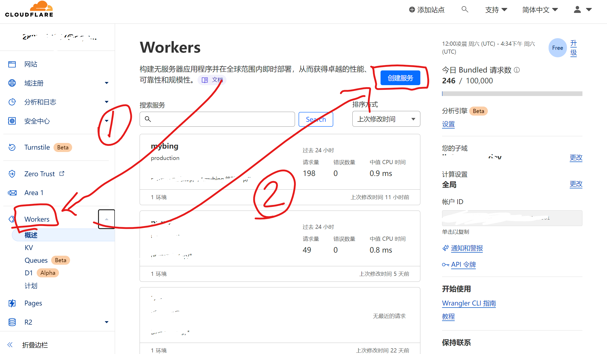
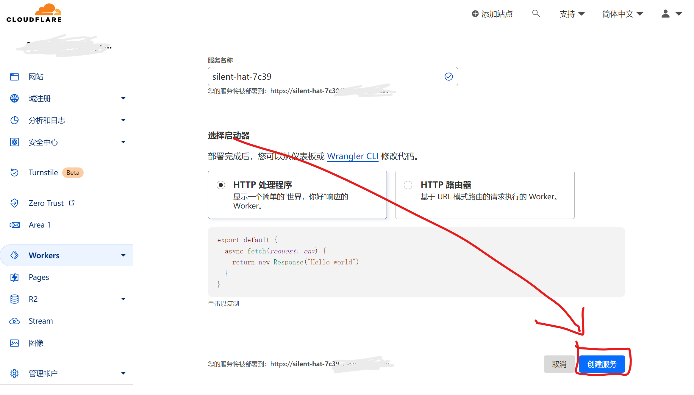
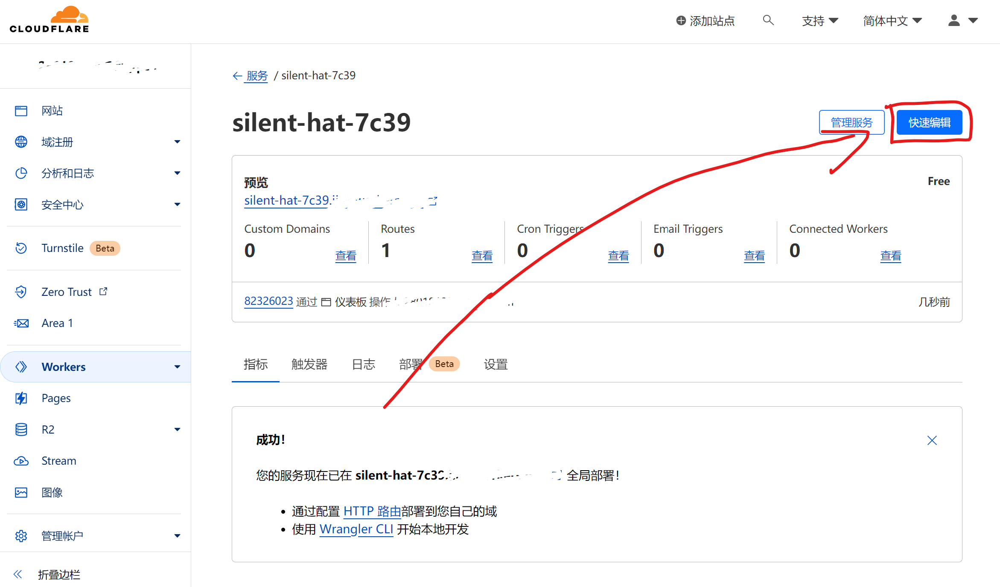
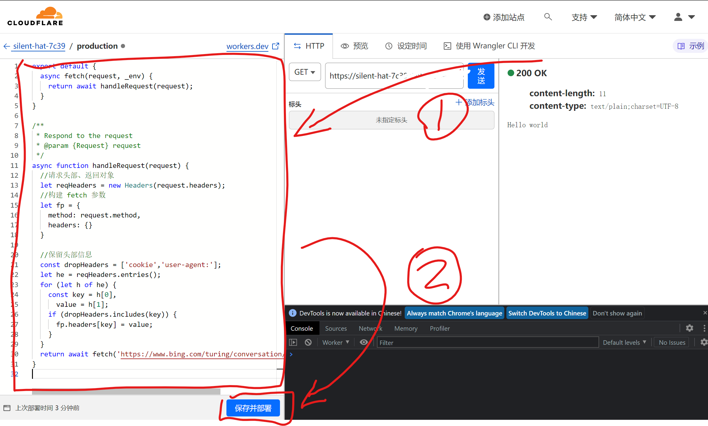
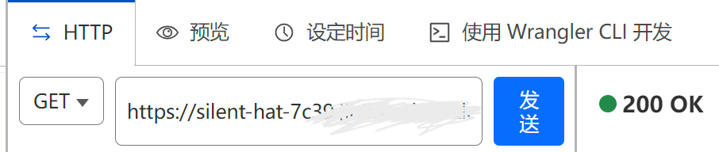

## 创建自己的 cloudflare 的 worker （这是免费的）
首先打开这个网页，然后登录一下，没用登录就注册一下，只需要一个邮箱就可以了，什么邮箱都可以，页面是英语的，但是不会还有人不会用翻译软件吧！
~~~
https://workers.cloudflare.com/
~~~
登录完之后

把代码粘贴进去，代码在这 [worker.js](./cloudflare/worker.js)

下面这张照片显示的就是你的魔法链接

.workers.dev 结尾的域名在国内DNS被污染得很严重，甚至有些地区完全无法访问，建议绑定一个自己的域名，这样访问速度更快。当然你可以通过设置host文件解决这个问题，这里我就不细说了。

## 其他的用法
其实魔法链接可以直接填这个，因为这就是bing的创建聊天的api。可以试试，或许能访问，如果不能访问就只能代理了。
~~~
https://www.bing.com/turing/conversation/create
~~~
当然不使用 cloudflare 的 worker 用别的方法代理也是可以的，只要请求的地址返回从这个api获取的数据就可以了。当然请求的时候记得带上Cookit，甚至可以用这个方法分享自己的newbing资格给其他人用。