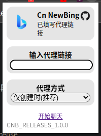
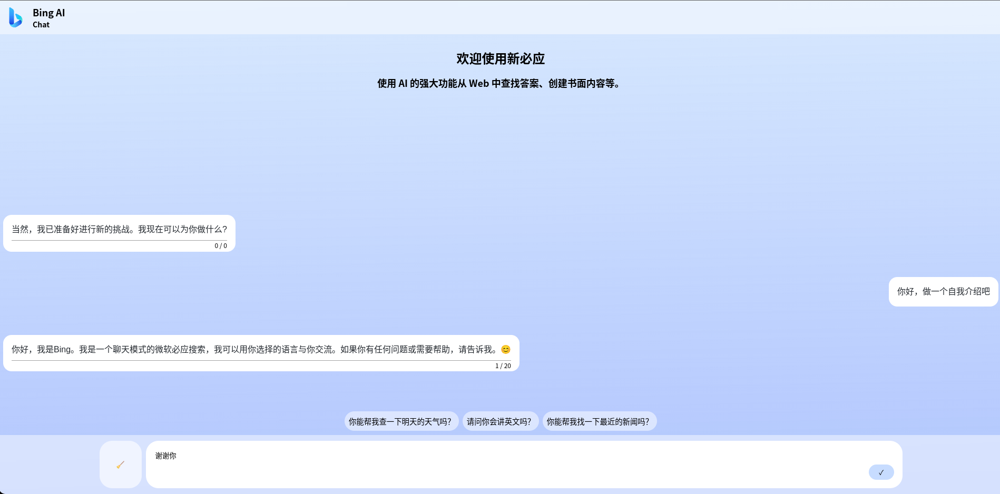

# Cn-NewBing : 免去复杂手段使用Bing AI的插件
> *本项目Fork自 [jja8/NewBingGoGo](https://gitee.com/jja8/NewBingGoGo "jja8/NewBingGoGo")  ，并且做了些修改*

## 截图

## 浏览器使用建议
> 只建议使用以下列出的浏览器，否则可能会出现无法意料的错误。

- Edge（Linux和Windows）
- Chrome或chromium（Linux和Windows）
- kiwi browser（Android）
- 猴狐浏览器 （Android） *不建议，安装扩展不方便*

## 反馈
我们非常欢迎大家反馈自己的建议，和在使用插件的过程中遇到的问题。
但是在提问前，善用搜索，学会提问的艺术。不要提重复问题、文档中已经提到过的问题、搜索引擎就可以搜到的弱智问题。否则不要怪我们不回复或者态度不好。

[提交反馈 / issues](./issues)

### 提交建议
非常欢迎大家反馈自己的建议，如果有好的建议可以随时新建一个issues。

### 反馈问题
如果遇到问题可以先收索下issues，如果有相同的问题可以参考其他人的解决方案。
如果遇到无法解决的问题可以提新的issues，如果是插件运行时发生的问题，请打开F12切换到控制台将红色的报错信息截图提交。如果是其他问题请配上说明。

### 注意区分
本项目是[jja8/NewBingGoGo](https://gitee.com/jja8/NewBingGoGo "jja8/NewBingGoGo")的分叉，某些问题可能是原项目的问题而并非是本项目的问题。

## 使用方法

### 大致步骤

1.将插件安装到浏览器

2.填写代理链接

3.在 bing.com 登录微软账号

4.开始聊天

## 代理链接
我不会公开提供代理链接，因为这是有风险的。
请求创建聊天的API需要你的Cookie，所以在请求的时候所有'.bing.com' 的Cookie都会被发送代理链接，所以我非常不推荐使用别人分享给你的代理链接，除非是你非常信任的人。**Cookie泄漏是非常危险的，假如他人拿到你的Cookie可以直接登录你的微软账号。**
了解如何[创建自己的代理链接](./docs/%E5%88%9B%E5%BB%BA%E8%87%AA%E5%B7%B1%E7%9A%84%E9%AD%94%E6%B3%95%E9%93%BE%E6%8E%A5.md)

## 技术原理

[技术原理](./docs/%E6%8A%80%E6%9C%AF%E5%8E%9F%E7%90%86.md)

## 关于
这是一个免去复杂手段使用Bing AI的插件。
本项目是 [jja8/NewBingGoGo](https://gitee.com/jja8/NewBingGoGo "jja8/NewBingGoGo") 的分支，根据个人习惯在原项目的基础上做了一些修改。
插件模拟了bing发送数据包，通过代理链接与bing交换数据，再创建一个页面用于和bing聊天。

*本项目仅供学习和交流*