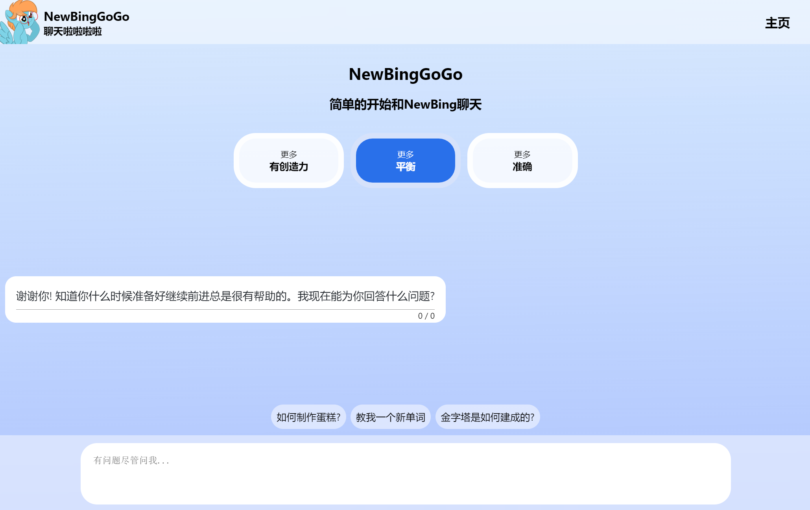
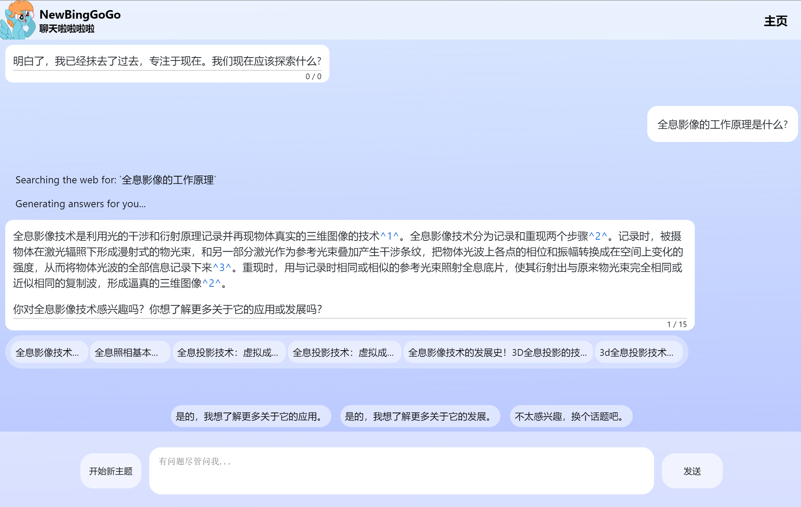
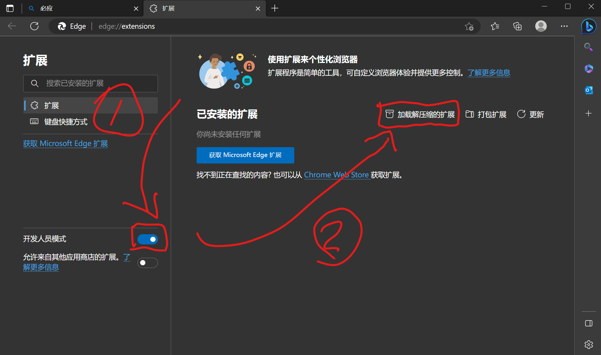
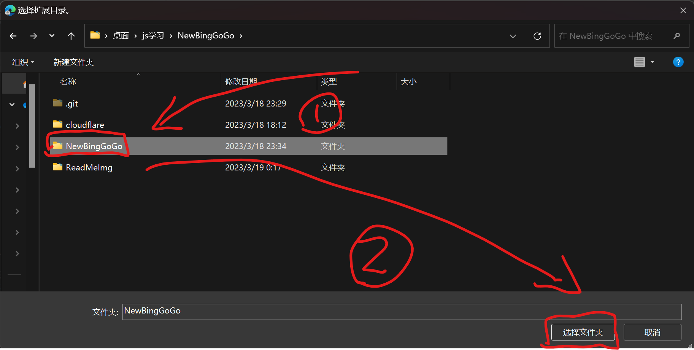
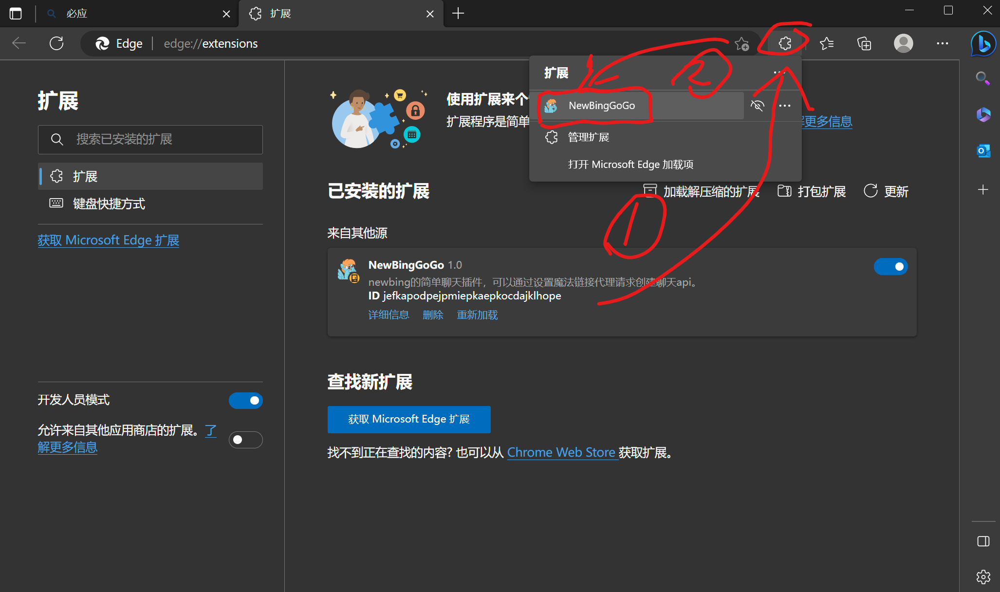
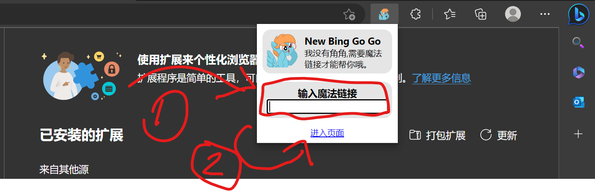
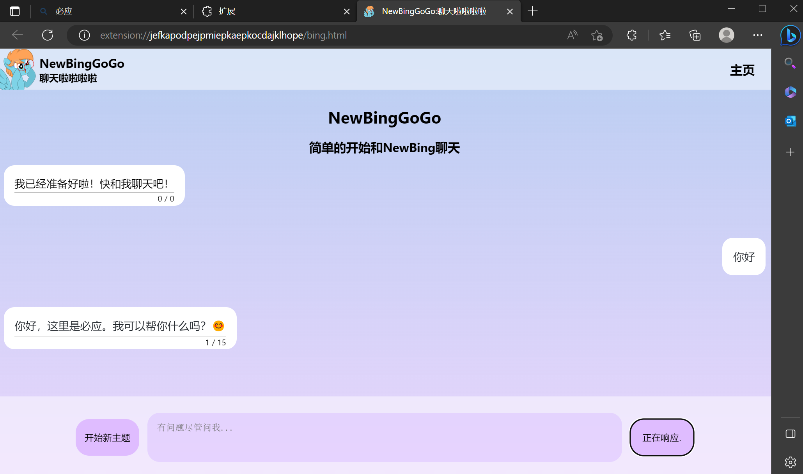

# NewBingGoGo : 简单开始和NewBing聊天

## 使用方法

### 大致步骤
1.将插件安装到浏览器

2.填写魔法链接

3.在cn.bing.com登录微软账号

4.开始愉快的聊天

### 详细步骤

我的魔法链接是下面这个，但是强烈不推荐大家用我的。建议自己创建最好的，或者用朋友的，创建的方法在最后面有写。（如果你们都用我的，小心把你们的Cookit全部存起来干好事awa）下面有cloudflareWorker创建魔法链接的教程。
~~~
https://mybing.xn--xyza.top/
~~~

之后就进入到聊天页面啦！如果没用登录bing就去bing登录一下，插件会自动读取Cookit之后就可以用啦。

### 安全问题
因为请求创建聊天的api是需要Cookit的，所以在请求的时候所有'.bing.cn' 的Cookit都会被发送魔法链接，所以我非常不推荐使用别人分享给你的魔法链接，除非是非常信任的人。**Cookit泄漏是非常危险的，他人拿到你的Cookit可以不需要密码，不需要验证码，直接登录你的微软账号。**

## 技术原理

[技术原理.md](./docs/%E6%8A%80%E6%9C%AF%E5%8E%9F%E7%90%86.md)

## 魔法链接
我的魔法链接是下面这个，但是强烈不推荐大家用我的。建议自己创建最好的，或者用朋友的（如果你们都用我的，小心把你们的Cookit全部存起来干好事awa）

---
[创建自己的魔法链接.md](./docs/%E5%88%9B%E5%BB%BA%E8%87%AA%E5%B7%B1%E7%9A%84%E9%AD%94%E6%B3%95%E9%93%BE%E6%8E%A5.md)

---
使用 Cloudflare Worker 创建的
~~~
https://mybing.xn--xyza.top/
~~~

---
使用 Railway 创建的
~~~
https://mybing1.xn--xyza.top/
~~~

## 聊天方式
- 正常聊天 -> 使用魔法创建聊天后不使用魔法了，这种方式速度快，推荐。
- 魔法聊天 -> 使用魔法创建聊天后继续使用魔法聊天，这种方式速度较慢，稳定性取决于魔法链接，建议正常聊天无法使用时用。

## 关于

此插件是我开发的第一个浏览器插件，**仅用于学习和交流。**

我现在大一，上学期学的html+css正好用上了，js这学期才开课，现在才学了一半，技术是真的不行，勉勉强强写出来了。如果觉得界面太丑还请见谅，漂亮的真的写不出来QAQ。

关于封号问题，这个是不存在的。只存在请求次数过多被限制的问题，通常第二天就好了。虽然不存在封号问题，但是为了我自己放心，调用api的时候还是严格按照官网上的请求格式调用的，不会有特征问题，放心用就是了。

