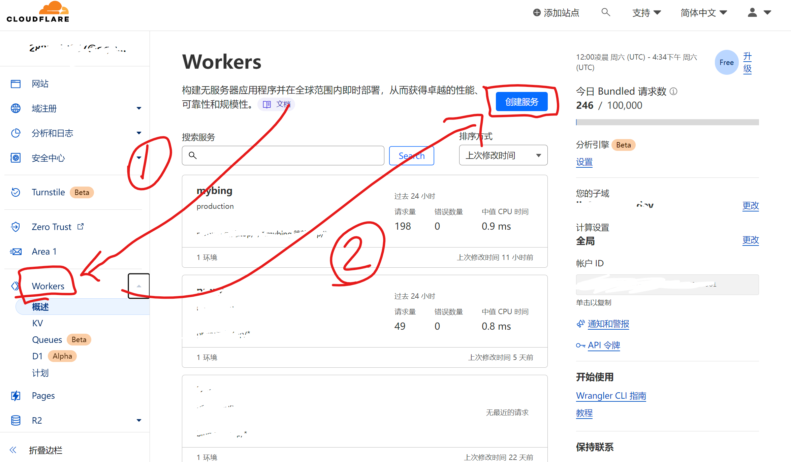
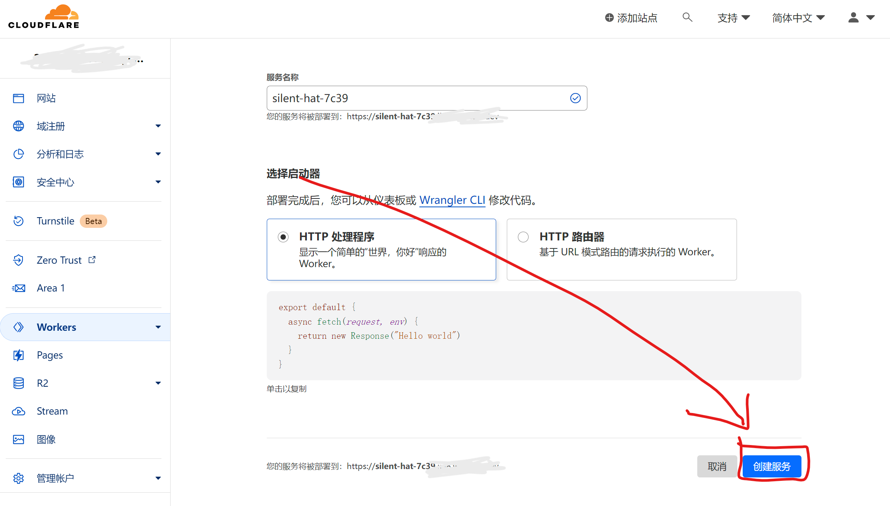
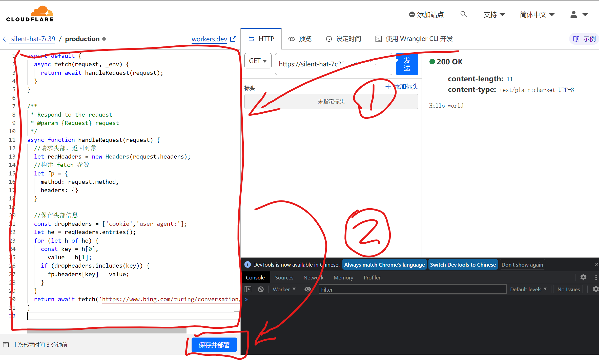

# NewBingGoGo : 简单开始和NewBing聊天

## 前言
目前在国内无法使用newbing，之前通过在请求头添加X-Forwarded-For的方法也不能用了。只有魔法才能用newbing了。但是newbing真的太好用了，我自从用过之后就再也停不下来了。于是我又开始寻找不需要魔法的方法。（因为真的太贫穷了魔法对我来说还是太贵了，不然也不用折腾了。）有一次我打开科学上newbing查资料，之后关掉了魔法，然后居然还能用。于是我就打开network调试看了下，发现聊天的api不需要魔法也可以用，但是请求创建聊天的api没有魔法是不能用的，于是就有了写这个插件的想法。

~~~ js
'https://www.bing.com/turing/conversation/create'  //需要魔法
'wss://sydney.bing.com/sydney/ChatHub'  //不需要魔法
~~~

## 技术原理

### 代理创建聊天的api

创建聊天的api是这个
~~~ js
'https://www.bing.com/turing/conversation/create'
~~~
这个api请求只是请求一个 ‘对话id’ ‘用户id’ 和 ‘签名’ 返回的结果大致是这样
~~~ json
{
	"conversationId": "对话id",
	"clientId": "用户id",
	"conversationSignature": "签名",
	"result": {
		"value": "Success",
		"message": null
	}
}
~~~

### cloudflare Worker
创建聊天api请求数据量非常少，只需要代理这个请求就可以了。于是我想到了‘cloudflare’ 

cloudflare 的 worker 就可以轻松代理这种请求。

（其实数据量大也不是不能代理，就是免费额度就这么点分享几个人用就无了）

于是我就去github找了一波，然后改了一下（就是把没用的部分全删掉了，删了90%差不多，当时复制过来300多行，删完只有30行了）。代码在这里 -> [worker.js](./cloudflare/worker.js)

其实就是 ‘浏览器 -> cloudflare worker -> 创建聊天的api’

这样创建聊天的api就搞定啦。

### 安全问题
因为请求创建聊天的api是需要Cookit的，所以在请求的时候所有'.bing.cn' 的Cookit都会被发送到代理，所以我非常不推荐使用别人分享给你的魔法链接，除非是非常信任的人。**Cookit泄漏是非常危险的，他人拿到你的Cookit可以不需要密码，不需要验证码，直接登录你的微软账号。**

## 使用方法

### 大致步骤
1.将插件安装到浏览器

2.填写魔法链接

3.在cn.bing.com登录微软账号

4.开始愉快的聊天

### 详细步骤

我的魔法链接是下面这个，但是强烈不推荐大家用我的。建议自己创建一个cloudflare 的 worker 是最好的，或者用朋友的。（如果你们都用我的，小心把你们的Cookit全部存起来干好事awa）下面有创建 cloudflare 的 worker 的教程。
~~~
https://mybing.xn--xyza.top/
~~~

之后就进入到聊天页面啦！如果没用登录bing就去bing登录一下，插件会自动读取Cookit之后就可以用啦。

## 创建自己的 cloudflare 的 worker （这是免费的）
首先打开这个网页，然后登录一下，没用登录就注册一下，只需要一个邮箱就可以了，什么邮箱都可以，页面是英语的，但是不会还有人不会用翻译软件吧！
~~~
https://workers.cloudflare.com/
~~~
登录完之后

把代码粘贴进去，代码在这 [worker.js](./cloudflare/worker.js)

下面这张照片显示的就是你的魔法链接

.workers.dev 结尾的域名在国内DNS被污染得很严重，甚至有些地区完全无法访问，建议绑定一个自己的域名，这样访问速度更快。当然你可以通过设置host文件解决这个问题，这里我就不细说了。

## 其他的用法
其实魔法链接可以直接填这个，因为这就是bing的创建聊天的api。可以试试，或许能访问，如果不能访问就只能代理了。
~~~
https://www.bing.com/turing/conversation/create
~~~
当然不使用 cloudflare 的 worker 用别的方法代理也是可以的，只要请求的地址返回从这个api获取的数据就可以了。当然请求的时候记得带上Cookit，甚至可以用这个方法分享自己的newbing资格给其他人用。

