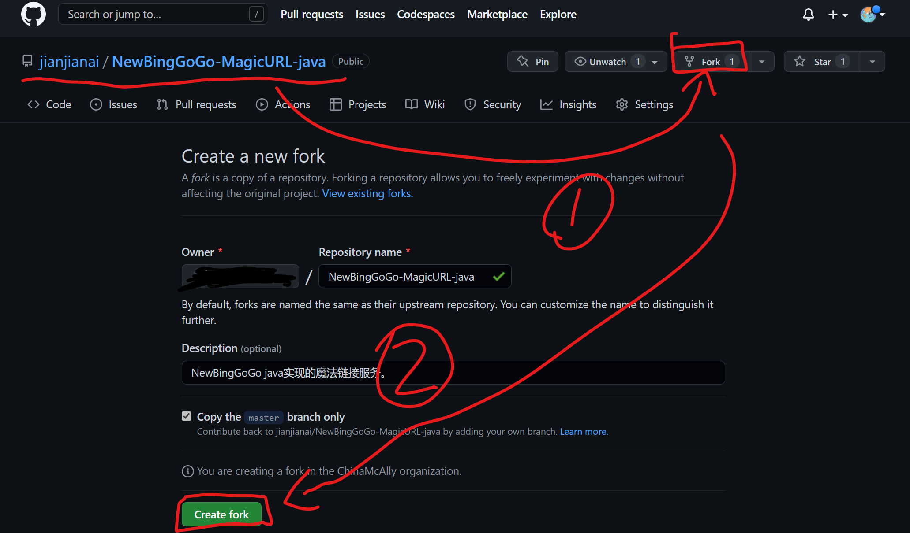
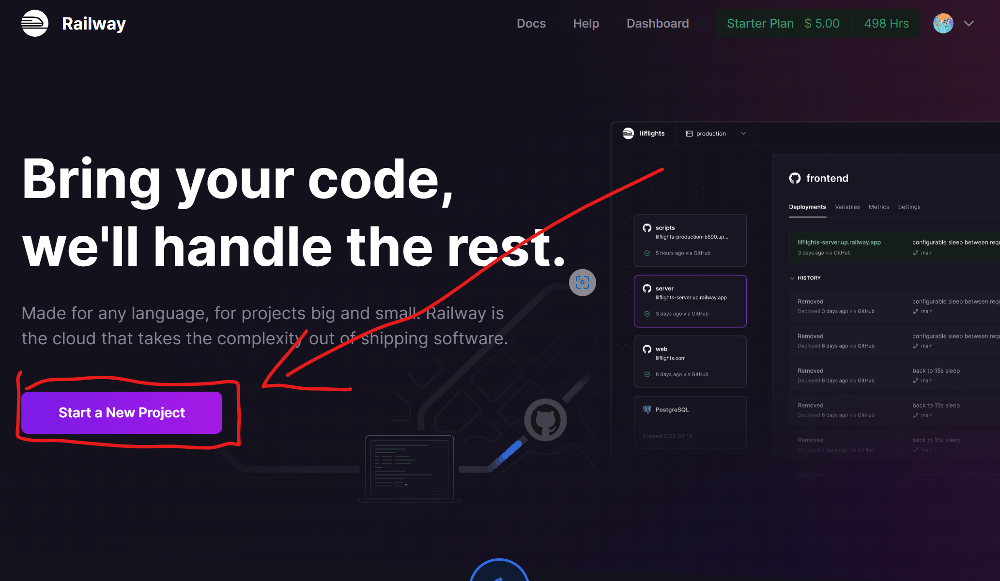
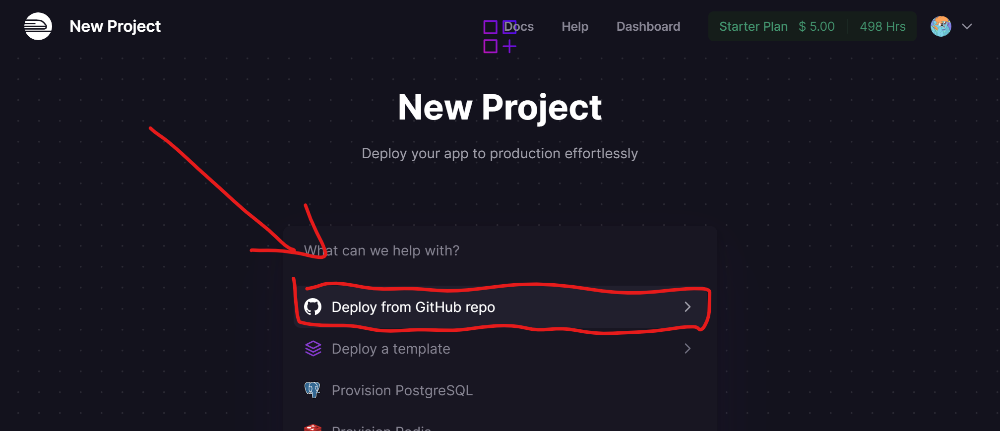
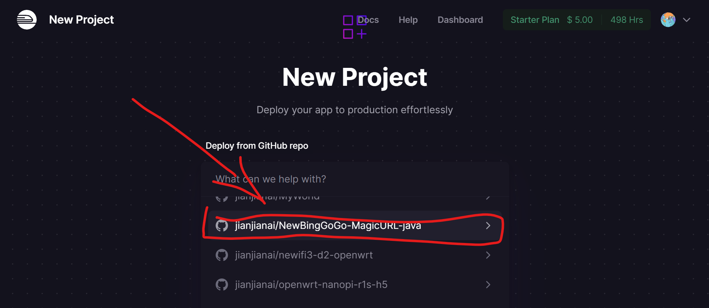
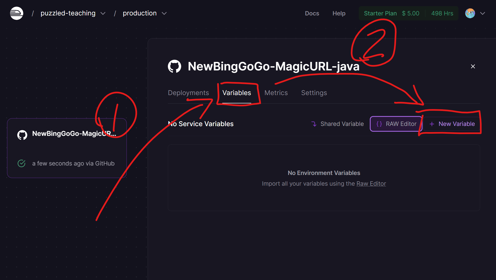
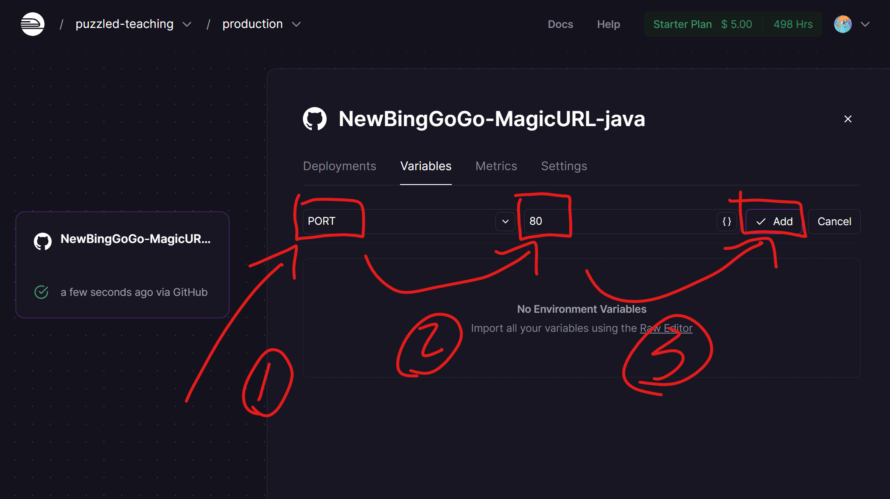
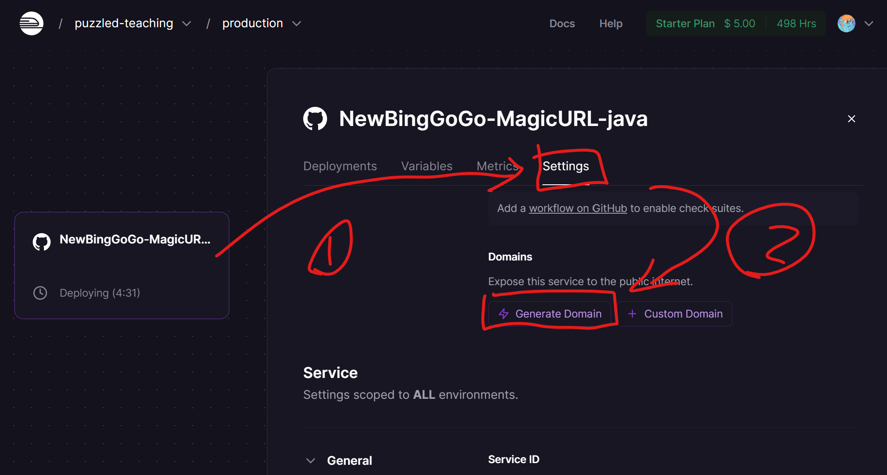

# Railway创建魔法链接
首先打开这个github仓库，Fork一个
~~~
https://github.com/jianjianai/NewBingGoGo-MagicURL-java
~~~

之后打开这个网站
~~~
https://railway.app/
~~~

找到刚才Fork的仓库

添加环境变量
~~~
PORT    80
~~~

创建链接

这个链接就是魔法链接啦！

