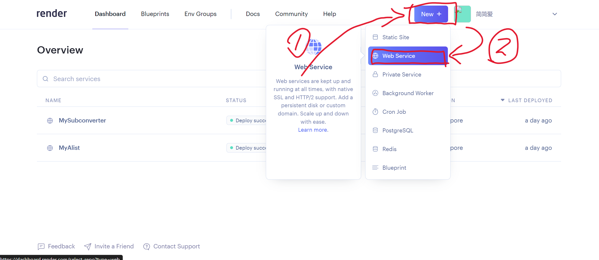
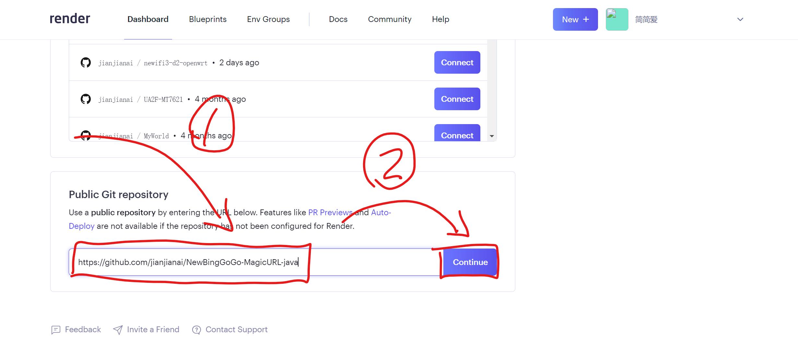
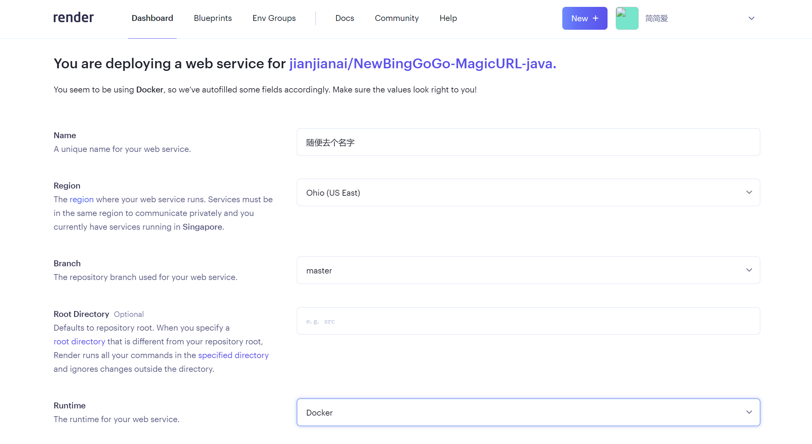
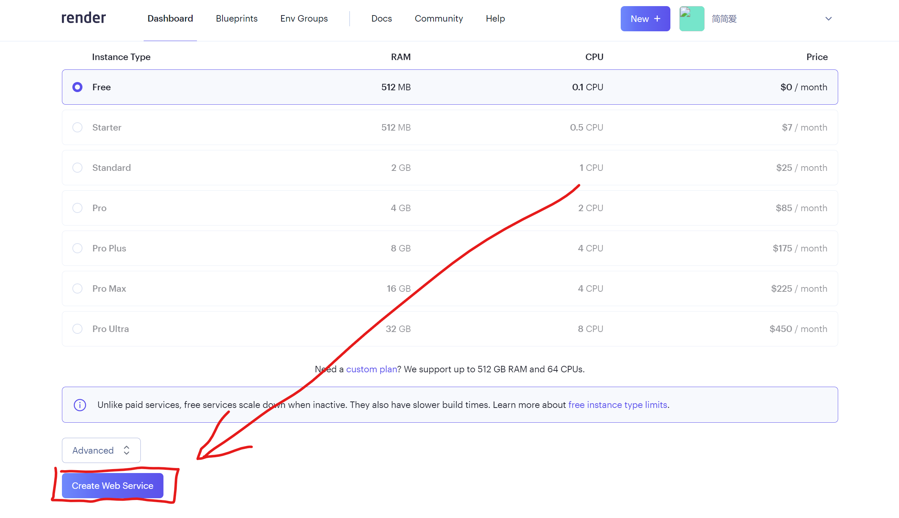
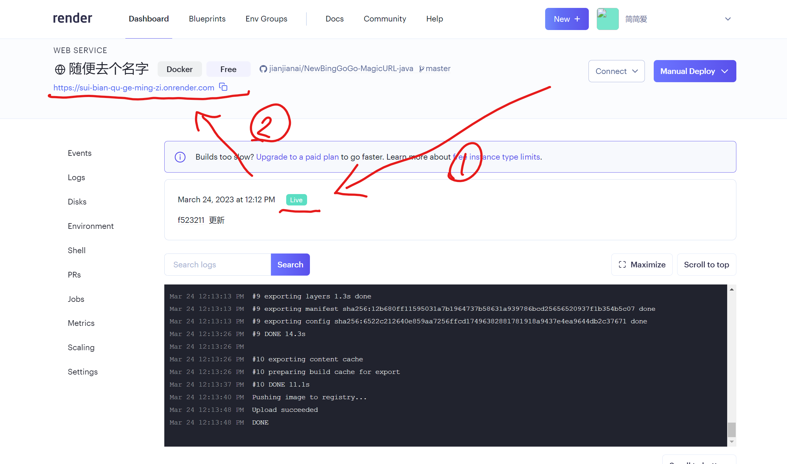

## 创建自己的render 的Web Service
首先打开这个网页，然后登录一下，如果没有登录就注册一下。反正免费的不要钱，一个邮箱就行。页面是英语的，但是不会还有人不会用翻译软件吧！
~~~
https://dashboard.render.com/
~~~
登录完之后，点击new Web Service

翻到下面使用公开git仓库创建，下面的链接。
~~~
https://github.com/jianjianai/NewBingGoGo-MagicURL-java
~~~

Region(地区) 这个选项建议选择欧洲地区，速度比较快。我这里选的是美洲地区。

向下翻，点击Crate Web Service

之后就开始自动编译并部署，等待状态变成Live(等待灰色变绿色)就完成了，上方显示的就是魔法链接。

